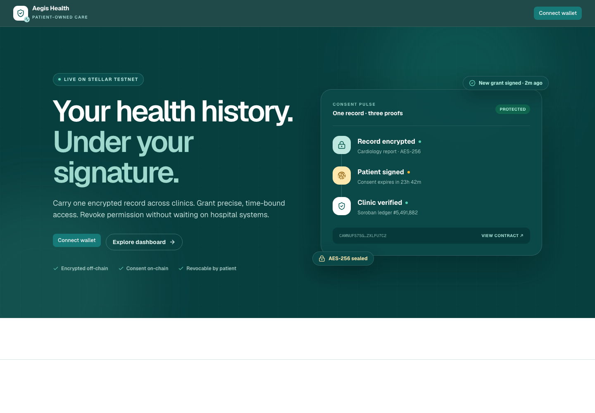
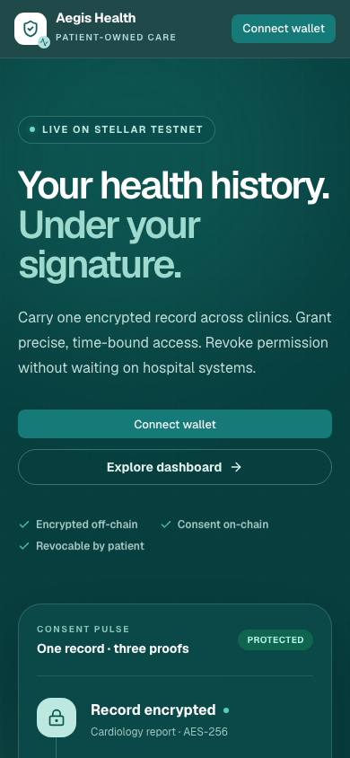
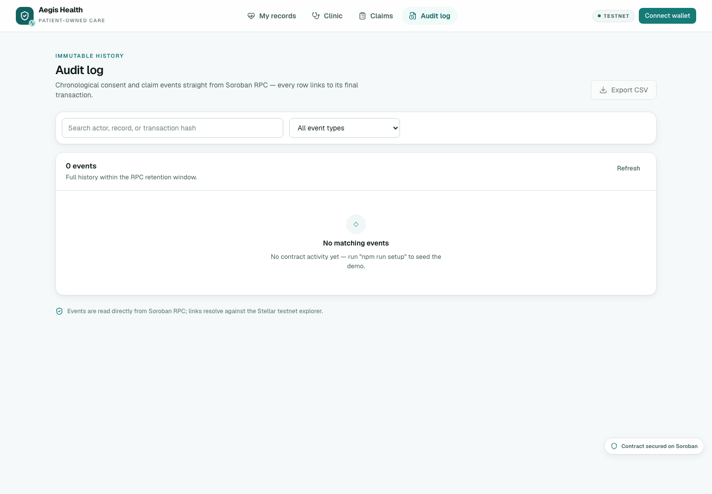
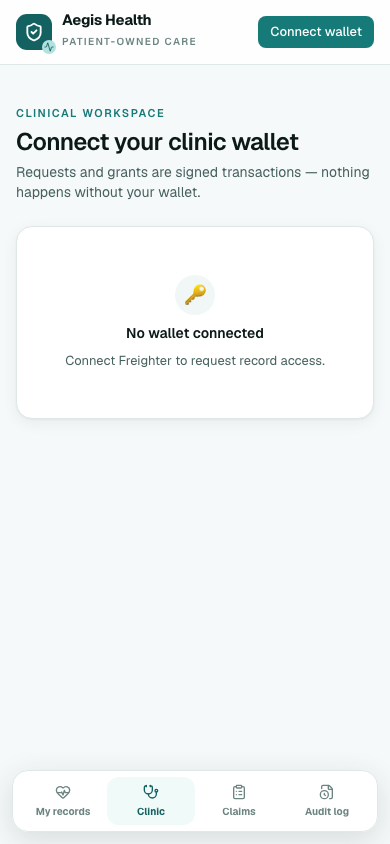

# Aegis Health

Patient-owned health records, consent controls, and claim settlement secured by Stellar Soroban.

> Testnet demo only. Do not enter real patient data. Aegis Health is not medical advice or a covered health service.

## Submission links

Fill these in before submitting the monthly challenge. Empty values are intentional placeholders for links that only exist after deployment or recording.

| Evidence | Link |
| --- | --- |
| Live deployment | [https://aegis-health-psi.vercel.app/](https://aegis-health-psi.vercel.app/) |
| Public GitHub repository | [https://github.com/rajiv-sys-bot/Aegis-Health](https://github.com/rajiv-sys-bot/Aegis-Health) |
| Pitch deck / PPT | [https://docs.google.com/presentation/d/1qLS91-Ei7CKsWkpiBM2gwIMHyjdP_EfZQrExtsTj4uo/edit?usp=sharing](https://docs.google.com/presentation/d/1qLS91-Ei7CKsWkpiBM2gwIMHyjdP_EfZQrExtsTj4uo/edit?usp=sharing)|
| Demo video (1–2 min) | [https://drive.google.com/file/d/1p4nUeOEobycbn7afOXhqxgpRjimcEH9N/view?usp=sharing](https://drive.google.com/file/d/1p4nUeOEobycbn7afOXhqxgpRjimcEH9N/view?usp=sharing)` |
| Contract address | [CAMNUFS7SGCTUQTLNYN7WM5AIEB22X4F3M72VVRMVXWMEQFWZXLFU7C2](https://stellar.expert/explorer/testnet/contract/CAMNUFS7SGCTUQTLNYN7WM5AIEB22X4F3M72VVRMVXWMEQFWZXLFU7C2) |
| transaction hash | [ef8298d077c6e7b49b8d9b8e2a253c06ca62a5ff0693e004472ed7ac27ea4280](https://stellar.expert/explorer/testnet/tx/ef8298d077c6e7b49b8d9b8e2a253c06ca62a5ff0693e004472ed7ac27ea4280) |
| User feedback form | [https://forms.gle/UhK2wWuYHKGpKmvMA](https://forms.gle/UhK2wWuYHKGpKmvMA)|
| Exported feedback sheet |[https://docs.google.com/spreadsheets/d/1fcN5CnYHLtw9vPVSbs6oVyawgnvMuJrfIdnJLrC4c0U/edit?usp=drivesdk](https://docs.google.com/spreadsheets/d/1fcN5CnYHLtw9vPVSbs6oVyawgnvMuJrfIdnJLrC4c0U/edit?usp=drivesdk) |

Detailed evidence matrix: [`docs/submission-checklist.md`](docs/submission-checklist.md).

## Product screenshots

Captured from the current local build. Mobile views use a 390px viewport; desktop views use a 1440px viewport.

| Landing · desktop | Landing · mobile |
| --- | --- |
|  |  |

| Audit log · desktop | Clinic wallet gate · mobile |
| --- | --- |
|  |  |

Screenshots show the unauthenticated state where a wallet is required. After `npm run setup` and Freighter connection, capture a second evidence set showing seeded records, live grants, claims, and transaction hashes.

## What is real in this repository

- Soroban contract source in [`contract/src`](contract/src), with role-based access, record registration and rotation, expiring grants, revocation, policies, and claim lifecycle.
- Five Rust contract tests covering initialization, grant expiry/revocation/key rotation, claim authorization and coverage, policy limits, and atomic provider payout.
- Next.js App Router frontend with patient, clinic, insurer, admin, and audit views.
- Freighter wallet signing for every state-changing contract call.
- Live Soroban RPC reads and typed event reduction for activity, consent, records, policies, and claims.
- Responsive mobile navigation and layouts, loading skeletons, empty states, retryable errors, transaction toasts, and reduced-motion CSS support.
- Audit search, event filtering, Stellar Expert links, and CSV export.
- Reproducible testnet setup script in [`scripts/setup.sh`](scripts/setup.sh).
- CI pipeline that installs dependencies, compiles the contract, runs contract tests, generates Next.js route types, type-checks, and lints the frontend.

## Product flow

1. Provider registers a record using a SHA-256 integrity identifier. Plaintext medical content stays off-chain.
2. Patient grants a clinic a role-scoped, time-bound permission by signing with Freighter.
3. Clinic requests access and verifies the live grant before a fetch.
4. Patient can revoke access or rotate the record key; the contract invalidates stale permission versions.
5. Insurer sets policy, reviews claims, and pays an approved provider atomically in the demo SAC token.
6. Every important action emits typed contract events visible in the Audit log.

## Smart contract details

Contract: `MedicalRecordsContract` in [`contract/src/lib.rs`](contract/src/lib.rs).

| Area | Contract methods | Rule enforced on-chain |
| --- | --- | --- |
| Initialization | `initialize`, `admin`, `transfer_admin` | Admin auth; initialization allowed once; admin transfer requires both signatures. |
| Roles | `set_role`, `role_of` | Admin assigns `Provider` or `Insurer`; admin cannot assign a role to itself. |
| Records | `register_record`, `get_record`, `rotate_record` | Provider and patient co-sign registration; patient owns updates; hashes only; rotation increments `key_version`. |
| Consent | `request_access`, `grant_access`, `get_grant`, `has_access`, `revoke_access` | Requests are audit-only; patient grants; expiry and record key version must remain live; patient can revoke. |
| Policies | `set_policy`, `get_policy` | Insurer role required; positive limit; active policy must have future expiry. |
| Claims | `submit_claim`, `get_claim` | Patient/provider co-sign submission; provider, insurer, record, access, policy, and coverage are checked. |
| Settlement | `approve_claim`, `reject_claim`, `cancel_claim`, `pay_claim` | Valid state transitions only; `pay_claim` transfers configured SAC token and marks claim paid atomically. |

### Contract data stored

- `MedicalRecord`: patient/provider addresses, encrypted-content hash, private-locator hash, timestamps, and encryption `key_version`.
- `AccessGrant`: patient/grantee, grant and expiry timestamps, key version, and encrypted-key-envelope commitment.
- `Policy`: insurer/patient pair, token address, maximum claim amount, expiry, and active flag.
- `Claim`: patient/provider/insurer, record, token, amount, evidence hash, submission time, and status (`Pending`, `Approved`, `Paid`, `Rejected`, `Cancelled`).

Plaintext medical files, private locators, encryption keys, and clinical details are not written to Soroban.

### Events

The contract emits typed events for `Initialized`, `AdminTransferred`, `RoleChanged`, `RecordRegistered`, `RecordRotated`, `AccessRequested`, `AccessGranted`, `AccessRevoked`, `PolicySet`, `ClaimSubmitted`, `ClaimApproved`, `ClaimRejected`, `ClaimCancelled`, and `ClaimPaid`. The frontend decodes these in [`lib/events.ts`](lib/events.ts) and renders them in the Audit log.

## How to use

### 1. Run the seeded testnet demo

```bash
npm install
npm run setup
npm run dev
```

Open `http://localhost:3000`, keep Freighter on Stellar **Testnet**, and import the local demo accounts from `scripts/aegis-accounts.local.env` when you need to test each role. This file is gitignored and contains secrets; never share or commit it.

`npm run setup` creates/funds demo accounts, deploys a fresh contract, configures Provider and Insurer roles, deploys/funds the demo SAC token, seeds records/grants/policy/claims, and writes `.env.local`.

### 2. Patient flow

1. Connect the patient wallet.
2. Open **My records** and review seeded records and active grants.
3. Select **Grant access**, choose a Provider or Insurer wallet, set expiry, and sign in Freighter.
4. Use **Revoke** to remove access immediately.
5. Rotate a record key when a new encrypted version is available; old grants stop passing `has_access`.

### 3. Clinic flow

1. Connect the Provider wallet and open **Clinic**.
2. Enter the patient wallet and 64-character record SHA-256 ID.
3. Submit an access request with a short duration.
4. After patient approval, use **Verify live grant** before releasing or fetching any off-chain payload.

### 4. Insurer flow

1. Connect the Insurer wallet and open **Claims**.
2. Review the active patient policy and pending claims.
3. Approve or reject a pending claim.
4. Pay an approved claim; the configured SAC token moves to the provider and the claim becomes `Paid` in one transaction.

### 5. Verify activity

Open **Audit log** to search/filter contract events, open each Stellar Expert transaction, and export the visible event set as CSV. Run `npm run smoke` to verify RPC connectivity and the configured deployed contract.

### 6. Use an external patient wallet

To let a tester use their own Freighter address as patient:

```bash
npm run setup -- --patient G...YOUR_TESTNET_ADDRESS
npm run dev
```

This mode skips patient-signed seeded records, grants, and claims. Register and sign those flows with the external patient wallet after deployment. Use testnet accounts only.

## Getting started

Requirements: Node.js 22+, npm, Rust, and the Stellar CLI with Soroban support.

```bash
npm install
npm run dev
```

Open [http://localhost:3000](http://localhost:3000).

For a fresh Stellar testnet deployment with seeded demo accounts, records, grants, policy, and claims:

```bash
npm run setup
npm run dev
```

The setup script writes local secrets to `.env.local`. Never commit that file or real patient data.

## Verification commands

```bash
npm run test:contract  # Rust/Soroban tests
npm run typecheck      # Next.js route type generation + TypeScript
npm run lint           # ESLint
npm run build          # Production build
npm run smoke          # RPC + deployed contract health check
```

### Contract test case and output

Test case: `approved_claim_pays_provider_atomically`

1. Initialize contract roles and register a patient record.
2. Set an active patient policy with coverage for the claim amount.
3. Submit a claim from the patient wallet.
4. Approve the claim as the insurer.
5. Pay the approved claim as the insurer.
6. Assert claim status is `Paid` and provider balance increases in the same contract flow.

Command:

```bash
npm run test:contract
```

Output:

```text
running 5 tests
test test::initializes_roles_and_record ... ok
test test::grants_expires_revokes_and_rotation_invalidates ... ok
test test::rejects_claim_over_policy_limit ... ok
test test::claim_requires_policy_access_and_coverage ... ok
test test::approved_claim_pays_provider_atomically ... ok

test result: ok. 5 passed; 0 failed
```

Source: [`contract/src/test.rs`](contract/src/test.rs). CI runs the same command on every push and pull request.

## Environment

Copy [`.env.example`](.env.example) only when connecting an existing deployment. `npm run setup` creates the values automatically.

- `NEXT_PUBLIC_CONTRACT_ID`: deployed medical records contract.
- `NEXT_PUBLIC_RPC_URL`: Soroban RPC endpoint; defaults to Stellar testnet.
- `NEXT_PUBLIC_TOKEN_ID`: SAC token contract used by the demo payout flow.
- `NEXT_PUBLIC_DEMO_*`: public demo account addresses only; secrets remain local.

## Architecture

```text
Freighter wallet
      │ signs contract calls
      ▼
Next.js App Router ── Soroban SDK ── Stellar testnet
      │                         ▲
      └── RPC reads + events ────┘

Encrypted record payloads stay off-chain.
Soroban stores hashes, permissions, expiry, roles, policies, claims, and events.
```

Frontend behavior is split between `app/` routes, reusable UI in `components/health-ui.tsx`, contract views in `hooks/use-views.ts`, event decoding in `lib/events.ts`, and generated client bindings in `lib/medical-contract`.

## Privacy and safety boundary

Aegis stores no plaintext medical record in the Soroban contract. The current demo uses integrity hashes and permission metadata. A production deployment still needs audited encryption/storage, key management, identity verification, access logging policy, threat modeling, legal/privacy review, and clinical safety review before handling real health information.
